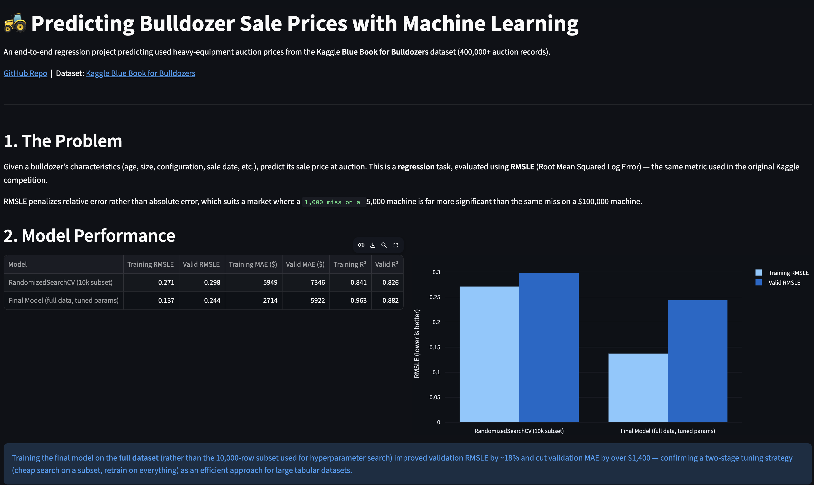

# 🚜 Bulldozer Price Predictor

An end-to-end machine learning project predicting used heavy-equipment auction prices from historical sales data, built on the Kaggle **Blue Book for Bulldozers** dataset (400,000+ auction records).

**[Live Demo](https://ghalys-bulldozer-price-prediction.streamlit.app/)** &nbsp;|&nbsp; **[Notebook](./end-to-end-bulldozer-price-predictions.ipynb)**



---

## Problem

Given a bulldozer's characteristics (Size, configuration, sale date, and more), predict its sale price at auction. This is a regression task evaluated using **RMSLE** (Root Mean Squared Log Error) — the metric used in the original Kaggle competition — which penalizes relative error rather than absolute error, appropriate for a market spanning $5,000 to $140,000+ machines.

## Results

| Model | Valid RMSLE | Valid MAE | Valid R² |
|---|---|---|---|
| RandomizedSearchCV (10k subset) | 0.298 | $7,346 | 0.826 |
| **Final model** (full data, tuned params) | **0.244** | **$5,922** | **0.882** |

A validation RMSLE of 0.244 corresponds to predictions typically within ~24-28% of actual sale price — a solid result given the inherent variance in used heavy-equipment auctions (condition, regional demand, and seller reputation aren't captured in the dataset).

## Key Findings

- **`YearMade` is the strongest predictor** (20.7% importance), consistent with domain intuition — equipment age drives resale value more than any other single factor.
- **Two-stage hyperparameter tuning paid off**: tuning on a 10,000-row subset, then retraining on the full dataset with the best parameters, improved validation RMSLE by ~18% over the subset-tuned model alone.
- **Prediction error is consistent across equipment sizes** (18-21% mean error across Compact, Small, Medium, Large, and Large/Medium categories) — the model doesn't have a systematic blind spot for any particular equipment class.
- **Limitation:** `SalesID` and `ModelID` show non-trivial feature importance despite being identifier fields with no causal relationship to price — likely reflecting incidental correlations (e.g., IDs assigned roughly in time order) rather than genuine signal. A candidate for removal in future iterations.

## Project Structure

```
bulldozer-price-project/
├── app.py                                        # Streamlit app
├── requirements.txt
├── data/
│   └── val_results.csv                           # Validation predictions + actuals + ProductSize
├── end-to-end-bulldozer-price-predictions.ipynb   # Full analysis notebook
└── README.md
```

## Approach

1. **Feature engineering** — decomposed `saledate` into year/month/day/day-of-week/day-of-year; converted string columns to pandas categoricals with missing-value indicator columns
2. **Modeling** — `RandomForestRegressor`, tuned via `RandomizedSearchCV` on a data subset, then retrained on the full dataset with the best parameters
3. **Evaluation** — custom RMSLE function matching the Kaggle competition metric, alongside MAE and R²
4. **Interpretation** — feature importance analysis and per-category error breakdown to check for systematic model weaknesses

## Run Locally

```bash
git clone <repo-url>
cd bulldozer-price-project
pip install -r requirements.txt
streamlit run app.py
```

## Tools

Python, pandas, scikit-learn, Streamlit, Plotly

---

*Dataset: [Kaggle Blue Book for Bulldozers](https://www.kaggle.com/c/bluebook-for-bulldozers)*
